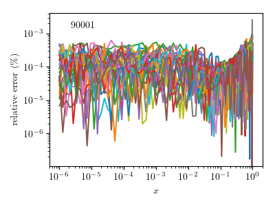
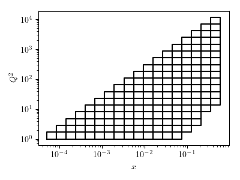

Getting started 
===============

In this tuotrial we will show how to use existing MC runs (msr) files to
compute DIS observables. A vanilla setup which includes MC samples extracted
from DIS data is available  at 
https://github.com/JeffersonLab/analysis-simul .

.. code-block:: python

   import os
   conf={}

   #--setup posterior sampling 
   conf['bootstrap']=False
   conf['flat par']=False
   conf['ftol']=1e-8

   #--setup qcd evolution
   conf['dglap mode']='truncated'
   conf['alphaSmode']='backward'
   conf['order'] = 'NLO'
   conf['Q20']   = 1.27**2

 
1. Things to have in your wdir
------------------------------
Unless you are are using the example repo, 
we will assume that you have folders with msr files 
and msr-inspected files.  

2. The driver.py
----------------

The ``driver.py`` for a basic the simulation 
looks like this

.. code-block:: python 

   #!/usr/bin/env python
   import os,sys
   
   import kmeanconf as kc
   from analysis.corelib import core
   from analysis.corelib import inspect
   from analysis.corelib import predict
   from analysis.corelib import classifier
   from analysis.corelib import optpriors
   from analysis.corelib import jar
   from analysis.corelib import mlsamples
   from analysis.corelib import summary
   from analysis.qpdlib  import tolhapdf
   from analysis.qpdlib  import benchmark
   from analysis.simlib  import sim
   
   wdir=sys.argv[1]
   
   #--initial processeing 
   #inspect.get_msr_inspected(wdir)
   #predict.get_predictions(wdir)
   #classifier.gen_labels(wdir,kc)
   #jar.gen_jar_file(wdir,kc)
   #summary.print_summary(wdir,kc)
   ##optpriors.gen_priors(wdir,kc,1000)
   
   
   #--DIS simulation (level 0)
   
   #--gen kinematics:  
   #--option==0 for lhapdf grid. To be use to create stfuncs grids
   #--option==1 physical grid using root_s 
   X,Q2=sim.get_xQ2_grid(option=0,rs=None,nx=10,nQ2=10)
   
   stf =['F2','FL','F3']
   idxs=[90001,90002,90003]
   for i in range(len(stf)):
       sim.gen_idis_xlsx(wdir,idxs[i],'p',stf[i],X,Q2)
   
   conf=sim.gen_conf_idis(wdir,idxs)
   predict.get_predictions(wdir,mod_conf=conf)
   sim.update_idis_tabs(wdir,idxs)
   sim.gen_lhapdf_dat_file(wdir,idxs,setlabel=0,dirname='JAM4EIC')
   
   info={}
   info['<description>'] = 'F2,F2 simulation for EIC'
   info['<index>']       = '0'
   info['<authors>']     = 'JAM Collaboration'
   info['<reference>']   = 'jam19'
   info['<particle>']    = 'p'
   sim.gen_lhapdf_info_file(wdir,idxs,info,dirname='JAM4EIC')
   
   sim.benchmark(wdir,idxs,'JAM4EIC')

As usual, it is expected that you run the ``driver.py`` as

.. code-block:: shell

   ./driver.py  <path-to-folder-containing msr folder > 

Basic usage
:::::::::::

- **sim.get_xQ2_grid**: this function generates the ``X-Q2`` grid. 
  **option=0** for lhapdf like grid and **option=1** for custum grid.

- **sim.gen_idis_xlsx**: this generates the corresponding xlsx file 
  inside ``<wdir>/sim/idx.xlsx``

- **sim.gen_conf_idis**: this adjust the ``conf`` dictionary to only 
  use the xlsx file for the simulation

- **get_predictions**: this will launch ``resman`` and compute the 
  observables for all the replicas in ``msr-inspected``

- **update_idis_tabs**: this will overwrite the previously generated
  xlsx files to add numerical values for the observable 
  (recall only one observable per table is allowed)

LHAPDF
::::::

If the simulated data is now needed to be converted into LHAPDF format we 
proceed to use the following routines

- **gen_lhapdf_dat_file**: this will generate the tables in LHAPDF format

- **sim.gen_lhapdf_info_file**: this will generate the info file which is 
  required by the LHAPDF program to load the tables

- **sim.benchmark**: as a sanity check we need to load the tables in lhapdf
  and compare for each ``x-Q2`` the true values and the interpolated values.
  The benchmark will create temporary symlinks at your lhapdf/share folder
  and upon completion it remove the symlinks. If you run into an error it 
  means you do not have permissions to write on lhapdf installation folder.
  i.e. you need to have your own lhapdf installation.
  The rutine will generate benchmark plots at 
  ``<wdir>/gallery/benchmark-<name>-idx.pdf``.
  You should see plot like this: 

  
Make sure that the relative errors for your observables are small enough (~1e-3) 
for further applications.  
  
Simulate statistical uncertainties
::::::::::::::::::::::::::::::::::

The relevant code lines to be added in the ``driver.py``
are the following

.. code-block:: python 

   #--DIS simulation (level 1)
   
   #--physical params
   rs= 140.7
   lum='10:fb-1'
   
   #--lhapdf set and stf idx
   iset,iF2,iFL,iF3=0,90001,90002,90003  
    
   #--names for the xlsx table
   dirname='JAM4EIC'             
   idx=90100              
   
   data=sim.get_xQ2_bins(rs=rs,nx=20,nQ2=20,sign=1,W2cut=10)
   sim.plot_kinematics(wdir,data)
   sim.gen_sim_idis_xlsx(wdir,dirname,iset,iF2,iFL,iF3,data,idx,lum) 

- **iset**: is the index associated with the lhapdf stfuncs tables
  generated before

- **iF2,iFL,iF3**: are the flavor indices as specified in the previous steps

- **sim.get_xQ2_bins**: this generates a dictionary of bins in x and Q2 
  in log space. 

- **gen_sim_idis_xlsx**: this rouine will produce a an xlsx table 
  with simulated statistical uncertainties. 

- **sim.plot_kinematics**: a simple routine to plot the generated kinematics

